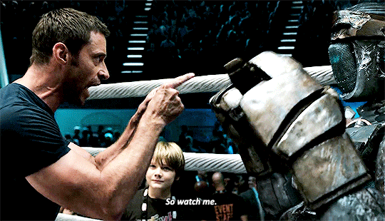
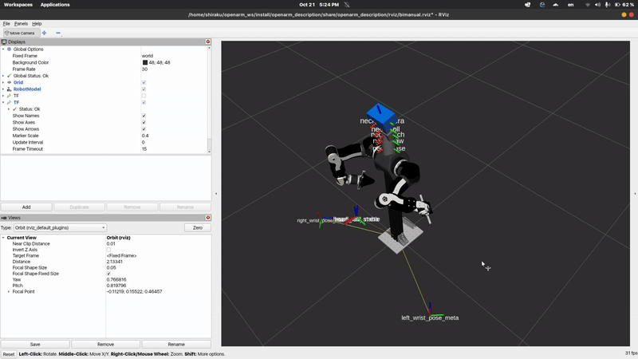

# Adaptive Teleoperation Mimicry (ATOM)

ATOM is a ROS 2-based teleoperation framework for real-time human-to-robot motion imitation.
It maps human wrist and head motion to robot joint trajectories using adaptive inverse kinematics (IK).

---




## Overview

* Real-time dual-arm and neck teleoperation
* Adaptive IK with retries, perturbations, and reach projection
* Optional motion scaling and trajectory smoothing
* Compatible with any robot publishing a valid URDF and TF tree

---

## Dependencies

ROS 2 (Humble or newer)
Python packages:

* rclpy
* tf2_ros
* kdl_parser_py
* PyKDL
* numpy

---

## Installation

```bash
cd ~/ros2_ws/src
git clone https://github.com/yourusername/adaptive-teleoperation-mimicry.git
cd ~/ros2_ws
colcon build
source install/setup.bash
```

---

## Usage

Launch your robot description and TF publishers, then run:

```bash
ros2 run teleop_controller tf_listener
ros2 run controller_manager spawner neck_joint_trajectory_controller
ros2 run teleop_controller neck_tracker
```

ATOM will:

* Retrieve `/robot_description`
* Build KDL chains for arms and neck
* Start tracking TF frames:

  * `left_wrist_pose_meta`
  * `right_wrist_pose_meta`
  * `head_stable_meta`

---

## Parameters

| Name                  | Default | Description                 |
| --------------------- | ------- | --------------------------- |
| control_rate          | 20.0    | Control loop rate (Hz)      |
| trajectory_duration   | 0.1     | Trajectory duration (s)     |
| enable_smoothing      | True    | Apply EMA smoothing         |
| smoothing_alpha       | 0.7     | EMA weighting factor        |
| reach_tolerance       | 1.2     | Reach tolerance multiplier  |
| ik_max_attempts       | 10      | IK retries                  |
| ik_perturbation_range | 1.0     | Perturbation range (rad)    |
| ik_eps                | 0.01    | IK solver epsilon           |
| ik_maxiter            | 2000    | IK solver iterations        |
| ik_publish_on_failure | True    | Publish best IK on failure  |
| ik_failure_tol        | 0.05    | Max IK error to publish (m) |
| project_out_of_reach  | True    | Project unreachable targets |
| projection_factor     | 0.95    | Reach projection factor     |
| use_relative_scaling  | True    | Enable motion scaling       |
| motion_scale          | 0.5     | Relative motion scale       |

---

## Example

ATOM expects TF frames representing tracked human motion.
These frames are converted to robot joint trajectories published to:

* `/left_joint_trajectory_controller/joint_trajectory`
* `/right_joint_trajectory_controller/joint_trajectory`
* `/neck_joint_trajectory_controller/joint_trajectory`

---

## License

MIT License
